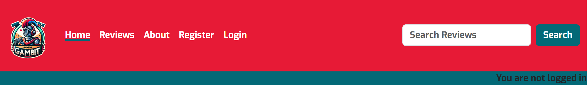
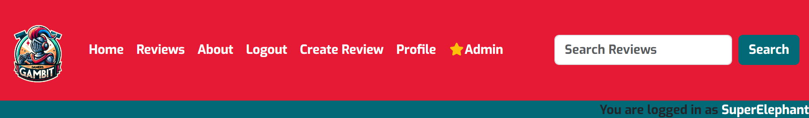
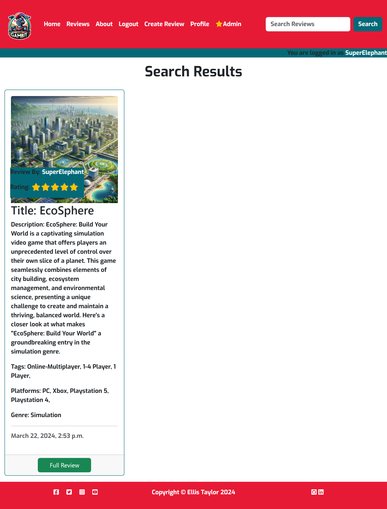
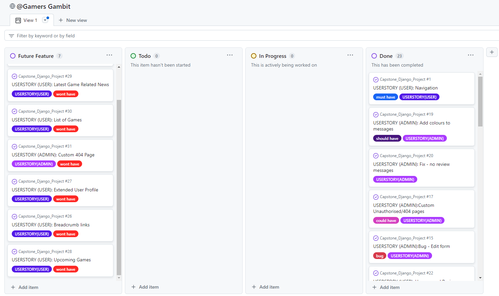
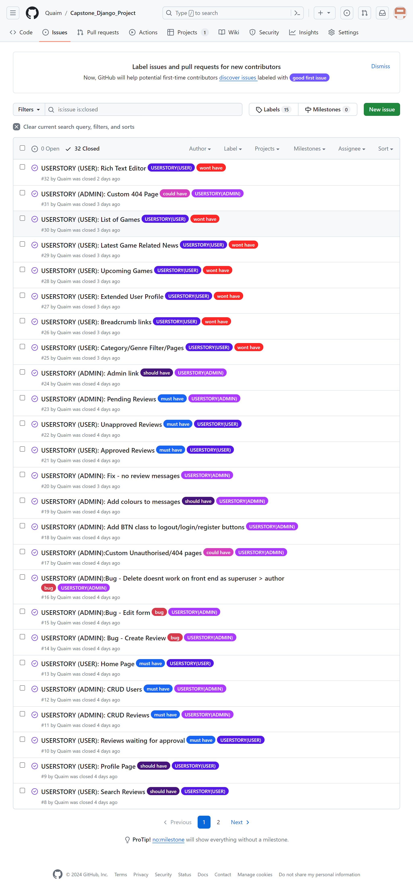

# [CAPSTONE DJANGO PROJECT](https://gamers-gambit-b5f3c4f8c27f.herokuapp.com)

[](https://github.com/Quaim/Capstone_Django_Project/commits/main)
[](https://github.com/Quaim/Capstone_Django_Project/commits/main)
[](https://github.com/Quaim/Capstone_Django_Project)

Welcome to Gamers Gambit (GG), the go-to destination for gamers seeking the latest reviews, news, and insights into the vast world of video games. Our mission is to explore the depths of gaming, from the adrenaline-pumping action of blockbuster titles to the thoughtful narratives of indie gems, providing our community with the knowledge they need to find their next great gaming adventure.
Join us as we navigate the ever-evolving landscapes of digital worlds, offering expert reviews and engaging content tailored for both the seasoned veterans and newcomers to the gaming scene. At Gamers Gambit , we're more than just a review site; we're a vibrant community of gamers sharing a passion for the art and culture of video games. Dive in and discover your next favourite game with us!

🛑🛑🛑🛑🛑🛑🛑🛑🛑START OF NOTES (to be deleted)

!! IMPORTANT !! RE: Table of Contents

DO NOT add a Table of Contents to your README or TESTING!!
These are outdated since 2021 when GitHub added them built-in to Markdown files automatically.

Assessors see this as bad practice since it's outdated for a few years now,
as if you've taken it from someone else's project that did the same thing.

---

In this section, you will include a few paragraphs providing an overview of your project.
Essentially, this part is your "sales pitch".

At this stage, you should have a name for your project so use it!
Don't introduce the project as a "portfolio project" for the diploma.

In this section, describe what the project hopes to accomplish, who it is intended to target, and how it will be useful to the target audience.

Consider adding a mockup image using the "Am I Responsive" website.
Here's your deployed site as an example:
https://ui.dev/amiresponsive?url=https://gamers-gambit-b5f3c4f8c27f.herokuapp.com

Screenshots for the README and testing should not be inside of `assets/` or `static/` image folders.
(reminder: `assets/` and `static/` are for files used on the live site, not documentation)
Consider adding a new folder called `documentation`, and add the amiresponsive screenshot inside of that folder.
To add the image into your README, use this format:
(assuming you have a new folder called `documentation` with an image called "mockup.png")


Note: Markdown files (.md) should not contain HTML elements like `img`, `br`, `div`, `a`, etc, only Markdown formatting.
Find out more about using Markdown elements here:
https://pandao.github.io/editor.md/en.html

---

GitHub now supports CALLOUTS in Markdown files.
There are some callouts already embedded in this application for you.
However, if you feel that you want to add more, there are certain ones you can use.

NOTE: the preview for callouts isn't yet supported in Gitpod/Codeanywhere/VSCode/etc.
You'll have to commit/push the changes to GitHub to see it in action.

> [!NOTE]  
> BLUE: Highlights information that users should take into account, even when skimming.

> [!TIP]  
> GREEN: Optional information to help a user be more successful.

> [!IMPORTANT]  
> PURPLE: Crucial information necessary for users to succeed.

> [!WARNING]  
> YELLOW: Critical content demanding immediate user attention due to potential risks.

> [!CAUTION]  
> RED: Negative potential consequences of an action.

Source: https://github.com/orgs/community/discussions/16925

🛑🛑🛑🛑🛑🛑🛑🛑🛑🛑-END OF NOTES (to be deleted)


source: [amiresponsive](https://ui.dev/amiresponsive?url=https://gamers-gambit-b5f3c4f8c27f.herokuapp.com)

## UX

🛑🛑🛑🛑🛑🛑🛑🛑🛑START OF NOTES (to be deleted)

I wanted the design to be simple and intuitive for all audiences so that it is accessible as possible as the target audience 
is essentially anyone and everyone, as long as they enjoy the world of gaming. 

🛑🛑🛑🛑🛑🛑🛑🛑🛑🛑-END OF NOTES (to be deleted)

### Colour Scheme

🛑🛑🛑🛑🛑🛑🛑🛑🛑START OF NOTES (to be deleted)

For the colour scheme I decided to keep it fairly simple with only a couple of main colours, I knew I wanted red and 
the green kind of came by accident but I was pleased with the overall aesthetic as there was a decent contrast between
the two colours. ChatGPT also had some input into this decision as I was making the logo for the website this is the colour scheme 
it provided when I asked for a vibrant colour scheme including red, and it produced the logo. I was pleased with with feel of it
and decided to use https://imagecolorpicker.com/ to find the exact colours within the logo and then use those colours for the theme of 
the site.

🛑🛑🛑🛑🛑🛑🛑🛑🛑🛑-END OF NOTES (to be deleted)

- `#000000` used for the header and footer text.
- `#E84610` used for primary highlights.
- `#4A4A4F` used for secondary text.
- `#009FE3` used for secondary highlights.

🛑🛑🛑🛑🛑🛑🛑🛑🛑START OF NOTES (to be deleted)

Consider adding a link and screenshot for your colour scheme using "coolors".
https://coolors.co/generate

When you add a colour to the palette, the URL is dynamically updated, making it easier for you to return back to your colour palette later if needed.

Example:

🛑🛑🛑🛑🛑🛑🛑🛑🛑🛑-END OF NOTES (to be deleted)

I used [coolors.co](https://coolors.co/ffffff-212529-e71a36-036977) to generate my colour palette.


### Typography

🛑🛑🛑🛑🛑🛑🛑🛑🛑START OF NOTES (to be deleted)

Explain any fonts and icon libraries used, like Google Fonts and/or Font Awesome.

Consider adding a link to each font used, and the Font Awesome site if used (or similar icon library).

Example:

🛑🛑🛑🛑🛑🛑🛑🛑🛑🛑-END OF NOTES (to be deleted)

- [Montserrat](https://fonts.google.com/specimen/Montserrat) was used for the primary headers and titles.

- [Lato](https://fonts.google.com/specimen/Lato) was used for all other secondary text.

- [Font Awesome](https://fontawesome.com) icons were used throughout the site, such as the social media icons in the footer.

## User Stories

🛑🛑🛑🛑🛑🛑🛑🛑🛑🛑 START OF NOTES (to be deleted)

In this section, list all of your user stories for the project.

🛑🛑🛑🛑🛑🛑🛑🛑🛑🛑-END OF NOTES (to be deleted)

### New Site Users

- As a user I want to be able to easily navigate between the various pages on the website so that I can access the content I am looking for efficiently.
- As a user I want to be able to view an about page that gives a detailed view of what the website is about so that I know what to expect from it.
- As a user I want to be welcomed to the website by a page that gives me an idea of what the website is about and has links to other necessary pages.
- As a user I want to be able to view a more detailed view of a particular review, so that I can read the full length review.
- As a user I want to be able to easily access the public reviews so that I can explore the various reviews and their contents.
- As a user I want to be able to search reviews so that I can easily retrieve only a certain type of review, by title, tag or platform.
- As a user I want to be able to easily sign up and login to the website to access the options and content only registered users have access to.
- As a user I want visual feedback when I perform an action to let me know if my action was successful/unsuccessful.

### Returning Site Users

- As a returning user I want access to a list of my unapproved reviews so that I can easily access them for edit or deletion.
- As a returning user I want to have access to a list of my approved reviews so that I can easily access them for edit or deletion.
- As a returning user I want to be able to create, read up date and delete my own reviews on the website so that others can access these reviews if they are approved.
- As a returning user I want access to a profile page that allows me to read, edit or delete my existing reviews.


### Site Admin

- As an Admin I should be able to create, read, update and delete reviews to keep the site in order.
- As an Admin I can create, read, update and delete users.
- As an Admin I want access to a list of reviews that are pending approval so that I can easily access them for approval or deletion.
- As an Admin I want a link to the admin page on the front end so I can easily access the admin page for database /site management.

## Wireframes

🛑🛑🛑🛑🛑🛑🛑🛑🛑🛑 START OF NOTES (to be deleted)

In this section, display your wireframe screenshots using a Markdown `table`.
Instructions on how to do Markdown `tables` start on line #213 on this site: https://pandao.github.io/editor.md/en.html

Alternatively, dropdowns are a way to condense several wireframes into a collapsible menu to save space.
Dropdowns in Markdown are considered some of the only acceptable HTML components that are allowed for assessment purposes.

⚠️ **IMPORTANT**! ⚠️ **IMPORTANT**! ⚠️ **IMPORTANT**! ⚠️
The example below uses the `details` and `summary` code elements.
However, for these scripts to work, I've had to add spaces within the `< >` elements.

You MUST remove these spaces for it to work properly on your own README/TESTING files.
Remove the spaces within the `< >` brackets for the `details` and `summary` code elements,
for the Mobile, Tablet, and Desktop wireframes.

🛑🛑🛑🛑🛑🛑🛑🛑🛑🛑-END OF NOTES (to be deleted)

To follow best practice, wireframes were developed for mobile  and desktop sizes.
I've used [Balsamiq](https://balsamiq.com/wireframes) to design my site wireframes.

### Mobile Wireframes

<details>
<summary> Click here to see the Mobile Wireframes </summary>

Home
  - 

About
  - 

All Reviews
  - 

Review Detail
  - 

Profile
  - 

</details>


### Desktop Wireframes

<details>
<summary> Click here to see the Desktop Wireframes </summary>

Home                                                                         
  -          

About
  - 

All Reviews
  - 

Review Detail
  - 

Profile
  - 

</details>

## Features

🛑🛑🛑🛑🛑🛑🛑🛑🛑🛑 START OF NOTES (to be deleted)

In this section, you should go over the different parts of your project,
and describe each in a sentence or so.

You will need to explain what value each of the features provides for the user,
focusing on who this website is for, what it is that they want to achieve,
and how your project is the best way to help them achieve these things.

For some/all of your features, you may choose to reference the specific project files that implement them.

IMPORTANT: Remember to always include a screenshot of each individual feature!

🛑🛑🛑🛑🛑🛑🛑🛑🛑🛑-END OF NOTES (to be deleted)

### Existing Features

- **NAVBAR-LOGGED OUT**

    - A navigation bar with all relevant links for the user when they first visit the site and are not logged in, including link to public pages and links to register to the site so they can access the part of the site that require being logged in. 



- **NAVBAR-LOGGED IN**

    - A navigation bar with all relevant links for a returning user when they are logged in to the site, including link to public pages and additional links to create a review and access their profile page. 


- **NAVBAR-ADMIN**

    - A navigation bar with all relevant links for an admin with the standard logged in links and the additon of a link that takes them to the admin panel of the site where they can manage the sites backend etc.



- **FOOTER**

    - A footer at the bottom of the page that has social media and linkedin/github links to the creator of the website as well as a copyright message with the owners name.


- **HOME PAGE**

    - Welcome page for users giving users an idea of what the site is about but not being overloaded with content


- **ABOUT PAGE**

    - Simple about page explaining what the website is about


- **ALL REVIEWS**

    - A page/pages where all public approved reviews are displayed to the user so they can explore them


- **REVIEW DETAIL NONAUTHOR/ADMIN OR LOGGED OUT**

    - After clicking the "full review" button users will be taken to a page showing the full review of the relevant entry.


- **REVIEW DETAIL USERS REVIEW**

    - After clicking the "full review" button users will be taken to a page showing the full review of the relevant entry, if the user created this review they will also see buttons for deleting or editing the review.


- **REVIEW DETAIL ADMIN**

    - After clicking the "full review" button users will be taken to a page showing the full review of the relevant entry, if the user is an admin they will also see a button for deleting the review if required.


- **PROFILE PAGE USER**

    - A simple profile page with buttons for accessing a users approved and unapproved reviews where they can edit or delete those reviews by clicking on the full review/user option button


- **PROFILE PAGE ADMIN**

    - A simple profile page with buttons for accessing a users approved and unapproved reviews where they can edit or delete those reviews by clicking on the full review/user option button. In addition, superusers/admins can access a button for pending reviews where they can then approve or reject/delete a review.


- **APPROVED REVIEWS**

    - A page that renders the current users approved reviews in the same manner as the all reviews page.


- **UNAPPROVED REVIEWS**

    - A page that renders the current users unapproved reviews in the same manner as the all reviews page.


- **PENDING REVIEWS (ADMIN)**

    - A page that renders the current all pending review in the same manner as the all reviews page. The admins will then have the option to approve or delete reviews accordingly.


- **CREATE REVIEW**

    - A page that presents a form for creating a new review, once submitted the review will be added to the database and added to the pending reviews page for an admin to either approve or delete the review if it doesnt meet the requirements. 


- **EDIT REVIEW**

    - A page where the user can edit their review, after they ahve clicked on the edit button the information from that review will be added into the form and they can add their edits, once submitted the review will then go back into pending review as the status of approved will be changed to false in case their changes do not comply with the criteria set by the site admins.


- **DELETE REVIEW**

    - On the review detail page of a review, if the user is either the author of that review or an admin they will have a button for deleting the current review from the database. Once clicked a modal will pop up asking them to confirm their decision.


- **SEARCH REVIEWS**

    - A search bar is located in the navbar on all pages and allows the user to search for a specific type of review, if a reviews platform, title, tags or genre contains that search query these reviews will be rendered in the same manner as the all reviews page.



- **LOGIN**

    - A page where returning users can enter their information to log in to the site.


- **LOGOUT**

    - A page allowing users to logout and confirm that they want to log out of the site.


- **REGISTER/SIGNUP**

    - A page where new users can register/signup to the site so they can access the content accessable only by logged in users.


- **UNAUTHORISED PAGE**

    - If users try to access a page restricted to only admins they will be presented with this page that tells them they dont have access and provides links back to the main site or to login incase they are an admin who hasnt logged in.


- **CUSTOM 404 PAGE**

    - If a user finds themselves on a page that doesnt exist they will be presented with a custom 404 page that provides links back to the main site.


### Future Features

There are various features that I didnt implemenet in this itteration of the site due to time constraints but would like to add in the future
to further flesh out the site and improve user experience.

- Filter/search by category/tag/genre/platform
    - As a User I want to easily access a list of categories/genres/tags/platforms so I can filter reviews by them
- Latest Gaming news
    - As a User I want access to a section dedicated to the latest game related news so I can keep up to date with gaming related information that might be of interest to me
- List of Games
    - As a User I want access to a page that is dedicated to storing a collection of all types of games so that I can browse games that might be of interest me and additionally have the option to add a review to that game
- Extended User Profile
    - As a User I want an extended profile with an image and additional information about myself so that other users and the admins can get a better sense of who I am and the website can tailor itself to my preferences etc
- Rich Text Editor
    - As a User I would like a rich text editor on the create/edit review form so that I can properly format my review to have proper headings and clear sections etc
- Breadcrumb Links
    - As a User I want a set of breadcrumb links on each page so that I can easily access relevant pages whilst browsing the site


## Tools & Technologies Used

- [](https://tim.2bn.dev/markdown-builder) used to generate README and TESTING templates.
- [](https://git-scm.com) used for version control. (`git add`, `git commit`, `git push`)
- [](https://github.com) used for secure online code storage.
- [](https://gitpod.io) used as a cloud-based IDE for development.
- [](https://en.wikipedia.org/wiki/HTML) used for the main site content.
- [](https://en.wikipedia.org/wiki/CSS) used for the main site design and layout.
- [](https://www.python.org) used as the back-end programming language.
- [](https://www.heroku.com) used for hosting the deployed back-end site.
- [](https://getbootstrap.com) used as the front-end CSS framework for modern responsiveness and pre-built components.
- [](https://www.djangoproject.com) used as the Python framework for the site.
- [](https://www.postgresql.org) used as the relational database management.
- [](https://www.elephantsql.com) used as the Postgres database.
- [](https://cloudinary.com) used for online static file storage.
- [](https://whitenoise.readthedocs.io) used for serving static files with Heroku.
- [](https://aws.amazon.com/s3) used for online static file storage.
- [](https://balsamiq.com/wireframes) used for creating wireframes.
- [](https://fontawesome.com) used for the icons.
- [](https://chat.openai.com) used to generate media for game reviews and site logo
- https://imagecolorpicker.com/ used to match the colours in the logo to use in the theme of the site

## Database Design

Entity Relationship Diagrams (ERD) help to visualize database architecture before creating models.
Understanding the relationships between different tables can save time later in the project. 

You can also generate a more comprehensive diagram of your model/s and their relationships, below is an example of my main midel and 
and auto generated ERD.

Main model

```python
class GameReview(models.Model):
    author = models.ForeignKey(
        User, on_delete=models.CASCADE, related_name='game_reviews', null=True
        )
    title = models.CharField(max_length=100, null=False, blank=False)
    slug = models.SlugField(max_length=200, blank=True)
    genre = models.ForeignKey(
        Genre, on_delete=models.CASCADE, null=True, blank=False
        )
    tags = models.ManyToManyField('Tag')
    platforms = models.ManyToManyField('Platform')
    description = models.CharField(max_length=550, null=False, blank=False)
    featured_image = CloudinaryField("image", default="placeholder")
    review = models.TextField(null=False, blank=False)
    rating = models.PositiveIntegerField(
        default=1, choices=[(i, i) for i in range(1, 6)]
        )
    created_on = models.DateTimeField(auto_now_add=True)
    approved = models.BooleanField(default=False)

    def save(self, *args, **kwargs):
        if not self.slug:  # Generate slug only if it's not already set
            self.slug = slugify(self.title)
        super().save(*args, **kwargs)

    def __str__(self):
        return self.title
```

I have used `pygraphviz` and `django-extensions` to auto-generate an ERD.

The steps taken were as follows:
- In the terminal: `sudo apt update`
- then: `sudo apt-get install python3-dev graphviz libgraphviz-dev pkg-config`
- then type `Y` to proceed
- then: `pip3 install django-extensions pygraphviz`
- in my `settings.py` file, I added the following to my `INSTALLED_APPS`:
```python
INSTALLED_APPS = [
    ...
    'django_extensions',
    ...
]
```
- back in the terminal: `python3 manage.py graph_models -a -o erd.png`
- dragged the new `erd.png` file into my `documentation/` folder
- removed `'django_extensions',` from my `INSTALLED_APPS`
- finally, in the terminal: `pip3 uninstall django-extensions pygraphviz -y`


source: [medium.com](https://medium.com/@yathomasi1/1-using-django-extensions-to-visualize-the-database-diagram-in-django-application-c5fa7e710e16)


## Agile Development Process

### GitHub Projects

[GitHub Projects](https://github.com/Quaim/Capstone_Django_Project/projects) served as an Agile tool for this project.
It isn't a specialized tool, but with the right tags and project creation/issue assignments, it can be made to work.

Through it, user stories, issues, and milestone tasks were planned, then tracked on a weekly basis using the basic Kanban board.



### GitHub Issues

[GitHub Issues](https://github.com/Quaim/Capstone_Django_Project/issues) served as an another Agile tool.
There, I used my own **User Story Template** to manage user stories.

It also helped with milestone iterations on a weekly basis. Below is a screenshot of the majority of my closed issues, all of the ones that could fit on one page.
I had no open issues when the project was handed in.

- [Closed Issues](https://github.com/Quaim/Capstone_Django_Project/issues?q=is%3Aissue+is%3Aclosed) [](https://github.com/Quaim/Capstone_Django_Project/issues?q=is%3Aissue+is%3Aclosed)

    

### MoSCoW Prioritization

I've decomposed my Epics into stories prior to prioritizing and implementing them.
Using this approach, I was able to apply the MoSCow prioritization and labels to my user stories within the Issues tab.

- **Must Have**: guaranteed to be delivered (*max 60% of stories*)
- **Should Have**: adds significant value, but not vital (*the rest ~20% of stories*)
- **Could Have**: has small impact if left out (*20% of stories*)
- **Won't Have**: not a priority for this iteration

## Testing

> [!NOTE]  
> For all testing, please refer to the [TESTING.md](TESTING.md) file.

## Deployment

The live deployed application can be found deployed on [Heroku](https://gamers-gambit-b5f3c4f8c27f.herokuapp.com).

### PostgreSQL Database

This project uses an [ElephantSQL](https://elephantsql.com).

To obtain my own Postgres Database from ElephantSQL, I followed these steps:

- Signed-in to the ElephantSQL using my github account.
- An email was sent to me with my new Postgres Database.

> [!CAUTION]  
> - ElephantSQL will be closing at the end of 2024, if you plan to clone/fork this repository
    you must acquire your own PostgreSQL database through some other method
> - You must then create an instance, follow the steps including picking a zone and selecting the free plan
> - You can then access your details tab and copy the elephant SQL database URL, this is the URL you will use in your
    project and set as a variable on your deployment service (such as Heroku, as was used for this project)
    as your DATABASE_URL (or whatever you chose to name this variable in your django project) 

### Cloudinary API

This project uses the [Cloudinary API](https://cloudinary.com) to store media assets online, due to the fact that Heroku doesn't persist this type of data.

To obtain your own Cloudinary API key, create an account and log in.

- For *Primary interest*, you can choose *Programmable Media for image and video API*.
- Optional: *edit your assigned cloud name to something more memorable*.
- On your Cloudinary Dashboard, you can copy your **API Environment Variable**.
- Be sure to remove the `CLOUDINARY_URL=` as part of the API **value**; this is the **key**.

### Heroku Deployment

This project uses [Heroku](https://www.heroku.com), a platform as a service (PaaS) that enables developers to build, run, and operate applications entirely in the cloud.

Deployment steps are as follows, after account setup:

- Select **New** in the top-right corner of your Heroku Dashboard, and select **Create new app** from the dropdown menu.
- Your app name must be unique, and then choose a region closest to you (EU or USA), and finally, select **Create App**.
- From the new app **Settings**, click **Reveal Config Vars**, and set your environment variables.

> [!IMPORTANT]  
> This is a sample only; you would replace the values with your own if cloning/forking my repository.

| Key | Value |
| --- | --- |
| `CLOUDINARY_URL` | user's own value |
| `DATABASE_URL` | user's own value |
| `DISABLE_COLLECTSTATIC` | 1 (*this is temporary, and can be removed for the final deployment*) |
| `SECRET_KEY` | user's own value |

Heroku needs three additional files in order to deploy properly.

- requirements.txt
- Procfile
- runtime.txt

You can install this project's **requirements** (where applicable) using:

- `pip3 install -r requirements.txt`

If you have your own packages that have been installed, then the requirements file needs updated using:

- `pip3 freeze --local > requirements.txt`

The **Procfile** can be created with the following command:

- `echo web: gunicorn app_name.wsgi > Procfile`
- *replace **app_name** with the name of your primary Django app name; the folder where settings.py is located*

The **runtime.txt** file needs to know which Python version you're using:
1. type: `python3 --version` in the terminal.
2. in the **runtime.txt** file, add your Python version:
	- `python-3.9.18`

For Heroku deployment, follow these steps to connect your own GitHub repository to the newly created app:

Either:

- Select **Automatic Deployment** from the Heroku app.

Or:

- In the Terminal/CLI, connect to Heroku using this command: `heroku login -i`
- Set the remote for Heroku: `heroku git:remote -a app_name` (replace *app_name* with your app name)
- After performing the standard Git `add`, `commit`, and `push` to GitHub, you can now type:
	- `git push heroku main`

The project should now be connected and deployed to Heroku!

### Local Deployment

This project can be cloned or forked in order to make a local copy on your own system.

For either method, you will need to install any applicable packages found within the *requirements.txt* file.

- `pip3 install -r requirements.txt`.

You will need to create a new file called `env.py` at the root-level,
and include the same environment variables listed above from the Heroku deployment steps.

> [!IMPORTANT]  
> This is a sample only; you would replace the values with your own if cloning/forking my repository.

Sample `env.py` file:

```python
import os

os.environ.setdefault("CLOUDINARY_URL", "user's own value")
os.environ.setdefault("DATABASE_URL", "user's own value")
os.environ.setdefault("SECRET_KEY", "user's own value")

# local environment only (do not include these in production/deployment!)
os.environ.setdefault("DEBUG", "True")
```

Once the project is cloned or forked, in order to run it locally, you'll need to follow these steps:

- Start the Django app: `python3 manage.py runserver`
- Stop the app once it's loaded: `CTRL+C` or `⌘+C` (Mac)
- Make any necessary migrations: `python3 manage.py makemigrations`
- Migrate the data to the database: `python3 manage.py migrate`
- Create a superuser: `python3 manage.py createsuperuser`
- Load fixtures (if applicable): `python3 manage.py loaddata file-name.json` (repeat for each file)
- Everything should be ready now, so run the Django app again: `python3 manage.py runserver`

#### Cloning

You can clone the repository by following these steps:

1. Go to the [GitHub repository](https://github.com/Quaim/Capstone_Django_Project) 
2. Locate the Code button above the list of files and click it 
3. Select if you prefer to clone using HTTPS, SSH, or GitHub CLI and click the copy button to copy the URL to your clipboard
4. Open Git Bash or Terminal
5. Change the current working directory to the one where you want the cloned directory
6. In your IDE Terminal, type the following command to clone my repository:
	- `git clone https://github.com/Quaim/Capstone_Django_Project.git`
7. Press Enter to create your local clone.

Alternatively, if using Gitpod, you can click below to create your own workspace using this repository.

[](https://gitpod.io/#https://github.com/Quaim/Capstone_Django_Project)

Please note that in order to directly open the project in Gitpod, you need to have the browser extension installed.
A tutorial on how to do that can be found [here](https://www.gitpod.io/docs/configure/user-settings/browser-extension).

#### Forking

By forking the GitHub Repository, we make a copy of the original repository on our GitHub account to view and/or make changes without affecting the original owner's repository.
You can fork this repository by using the following steps:

1. Log in to GitHub and locate the [GitHub Repository](https://github.com/Quaim/Capstone_Django_Project)
2. At the top of the Repository (not top of page) just above the "Settings" Button on the menu, locate the "Fork" Button.
3. Once clicked, you should now have a copy of the original repository in your own GitHub account!


## Credits

### Content

🛑🛑🛑🛑🛑🛑🛑🛑🛑🛑-START OF NOTES (to be deleted)

Use this space to provide attribution links to any borrowed code snippets, elements, or resources.
A few examples have been provided below to give you some ideas.

Ideally, you should provide an actual link to every resource used, not just a generic link to the main site!

⚠️⚠️ EXAMPLE LINKS - REPLACE WITH YOUR OWN ⚠️⚠️

🛑🛑🛑🛑🛑🛑🛑🛑🛑🛑-END OF NOTES (to be deleted)

| Source | Location | Notes |
| --- | --- | --- |
| [Markdown Builder](https://tim.2bn.dev/markdown-builder) | README and TESTING | tool to help generate the Markdown files |
| [Chris Beams](https://chris.beams.io/posts/git-commit) | version control | "How to Write a Git Commit Message" |
| [StackOverflow](https://stackoverflow.com/a/2450976) | quiz page | Fisher-Yates/Knuth shuffle in JS |
| [YouTube](https://www.youtube.com/watch?v=YL1F4dCUlLc) | leaderboard | using `localStorage()` in JS for high scores |
| [YouTube](https://www.youtube.com/watch?v=u51Zjlnui4Y) | PP3 terminal | tutorial for adding color to the Python terminal |
| 
| [WhiteNoise](http://whitenoise.evans.io) | entire site | hosting static files on Heroku temporarily |

### Media

| Source | Location | Type | Notes |
| --- | --- | --- | --- |
| [favicon](https://favicon.io/favicon-converter/) | entire site | image | favicon on all pages |
| [ChatGPT](https://chat.openai.com/) | entire site | images | all review images and site logo |


### Acknowledgements

- I would like to thank my Code Institute mentor, [Tim Nelson](https://github.com/TravelTimN) for his support throughout the development of this project.
- I would like to thank the [Code Institute](https://codeinstitute.net) tutor team for their assistance with troubleshooting and debugging some project issues.
- I would like to thank the [Code Institute Slack community](https://code-institute-room.slack.com) for the moral support; it kept me going during periods of self doubt and imposter syndrome.
- I would like to thank my fellow bootcampers on codeinstitute for being there for eachother and being a joy to work with over the course. 
